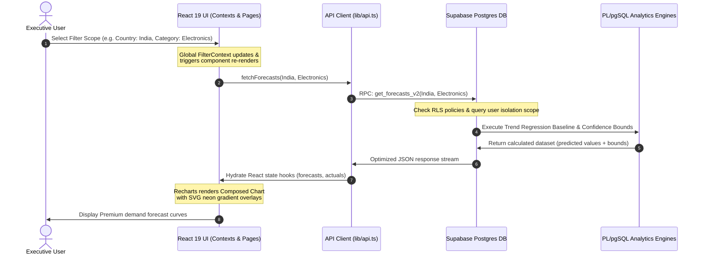

# 📊 OMNISALES — ADVANCED ANALYTICS, PREDICTIVE FORECASTING & AI INSIGHT ENGINE
> **Unified Multi-Channel Retail Intelligence Platform Powered by React 19, TypeScript, and Native Supabase SQL ML Computations**

---

## 📑 TABLE OF CONTENTS
1. [Executive Summary](#1-executive-summary)
2. [Ecosystem & Technology Stack](#2-ecosystem--technology-stack)
3. [System & Dataflow Architecture](#3-system--dataflow-architecture)
4. [Database Schema & Data Models](#4-database-schema--data-models)
5. [Technical Core Showcase](#5-technical-core-showcase)
   - [Native PL/pgSQL Forecasting Engine](#a-native-plpgsql-forecasting-engine)
   - [SQL Anomaly & AI Signal Generator](#b-sql-anomaly--ai-signal-generator)
   - [Fluid Framer Motion Route Orchestration](#c-fluid-framer-motion-route-orchestration)
6. [Interactive Feature Tour & Interface Walkthrough](#6-interactive-feature-tour--interface-walkthrough)
   - [Dashboard Overview](#a-dashboard-overview)
   - [Sales Analytics Hub](#b-sales-analytics-hub)
   - [Customer Behavior & Loyalty Analysis](#c-customer-behavior--loyalty-analysis)
   - [Stochastic Demand Forecasting](#d-stochastic-demand-forecasting)
   - [AI Strategic Insights Board](#e-ai-strategic-insights-board)
   - [Multi-Channel Transaction Entry](#f-multi-channel-transaction-entry)
7. [Installation, Seeding & Development Setup](#7-installation-seeding--development-setup)
8. [Architectural Advantages & Future Roadmap](#8-architectural-advantages--future-roadmap)

---

## 1. EXECUTIVE SUMMARY

**OmniSales** is an enterprise-grade, high-performance retail intelligence platform designed to bridge the gap between fragmented commerce channels. By unifying **offline retail outlets** and **online e-commerce storefronts** in real time, OmniSales provides decision-makers with a singular, cohesive pane of glass into organizational performance.

Traditional sales analysis tools suffer from high integration latency, isolated data silos, and excessive operational costs driven by heavy external machine learning (ML) microservices (e.g., dedicated Python servers running pandas or scikit-learn). **OmniSales solves these challenges fundamentally**:

*   **Real-time Channel Fusion:** Blends online and offline tables into a high-performance combined view instantly.
*   **Zero-Overhead Edge Computations:** Replaces external python processes with native **PostgreSQL PL/pgSQL ML engines** inside **Supabase**, calculating advanced trend-regressions, anomalies, and loyalty metrics directly at the database level.
*   **Stochastic Demand Forecasting:** Projects 4 months of future sales with dynamic confidence bounds (upper and lower ranges) and statistical significance checks.
*   **Immersive User Experience:** Built with React 19, custom Recharts layouts incorporating neon glow filters, Framer Motion transitions, and multi-currency adaptation.

---

## 2. ECOSYSTEM & TECHNOLOGY STACK

OmniSales leverages a modern, highly optimized stack chosen for speed, reliability, and visual clarity:

```
┌────────────────────────────────────────────────────────────────────────┐
│                          frontend layer (spa)                          │
│     React 19 (TS)   •   Vite   •   Tailwind CSS   •   Framer Motion    │
└──────────────────────────────────┬─────────────────────────────────────┘
                                   │ HTTPS RPC / WebSockets
┌──────────────────────────────────▼─────────────────────────────────────┐
│                         backend service (baas)                         │
│            Supabase   •   PostgreSQL   •   Row Level Security          │
└──────────────────────────────────┬─────────────────────────────────────┘
                                   │ Database Computations
┌──────────────────────────────────▼─────────────────────────────────────┐
│                        native intelligence                             │
│     Postgres PL/pgSQL Forecast Engine  •  Postgres AI Insights Engine  │
└────────────────────────────────────────────────────────────────────────┘
```

### 💻 Frontend Architecture
*   **Core Framework:** **React 19** utilizing TypeScript for absolute type safety and static contract validation.
*   **Build Utility:** **Vite** with Hot Module Replacement (HMR) for ultra-responsive developer cycles and rapid bundle compilation.
*   **Styling Engine:** **Tailwind CSS** with variable glassmorphism utility variables, dynamic dark mode compatibility, and strict spacing guidelines.
*   **Motion & Choreography:** **Framer Motion** for state-driven animated layout changes, scroll tracking, and page-to-page navigation transitions.
*   **Visualization Suite:** **Recharts** displaying composed area charts, bar charts, and dual-axis line overlays with customized SVG drop-shadow filters.

### 🗄️ Backend & Database Engine
*   **Database Host:** **Supabase** providing native Postgres capabilities, secure authentication, real-time client sync, and serverless Edge speed.
*   **Isolation Security:** **Row Level Security (RLS)** ensuring multi-tenant database compliance. Clients only query data bound strictly to their user ID token.
*   **Stored Computations:** Optimized **PL/pgSQL Remote Procedure Calls (RPCs)**, reducing API payload sizes and pushing data heavy calculations to database memory.

---

## 3. SYSTEM & DATAFLOW ARCHITECTURE

The diagram below details the end-to-end dataflow sequence, showing how user actions on the React UI trigger atomic RPC database computations and return highly optimized analytical models:



---

## 4. DATABASE SCHEMA & DATA MODELS

OmniSales leverages a normalized relational database design that prioritizes high indexing speeds, strict check constraints, and secure user sandboxing.

### Core Schemas

#### 1. Store Sales (`store_sales`)
Tracks physical, brick-and-mortar retail transactions.
| Column | Type | Constraints | Description |
| :--- | :--- | :--- | :--- |
| `id` | `uuid` | `PRIMARY KEY`, `DEFAULT gen_random_uuid()` | Unique transaction identifier. |
| `date` | `date` | `NOT NULL` | The date of sale. |
| `product_name` | `text` | `NOT NULL` | Item description name. |
| `category` | `text` | `NOT NULL` | Product department category. |
| `quantity` | `integer` | `NOT NULL CHECK (quantity > 0)` | Number of units purchased. |
| `price` | `numeric` | `NOT NULL CHECK (price >= 0)` | Price per unit in base currency. |
| `city` | `text` | `NOT NULL` | Physical store location name. |
| `created_at` | `timestamptz` | `DEFAULT now()` | Record creation timestamp. |

#### 2. Online Sales (`online_sales`)
Tracks digital commerce transactions.
| Column | Type | Constraints | Description |
| :--- | :--- | :--- | :--- |
| `id` | `uuid` | `PRIMARY KEY`, `DEFAULT gen_random_uuid()` | Unique transaction identifier. |
| `date` | `date` | `NOT NULL` | The date of purchase. |
| `product_name` | `text` | `NOT NULL` | Item description name. |
| `category` | `text` | `NOT NULL` | Product department category. |
| `quantity` | `integer` | `NOT NULL CHECK (quantity > 0)` | Number of units purchased. |
| `price` | `numeric` | `NOT NULL CHECK (price >= 0)` | Price per unit in base currency. |
| `location` | `text` | `NOT NULL` | Shipping destination region/state. |
| `created_at` | `timestamptz` | `DEFAULT now()` | Record creation timestamp. |

#### 3. Materialized Forecasts Table (`forecasts`)
Stores pre-calculated statistical trend regressions generated by the SQL ML engine.
| Column | Type | Constraints | Description |
| :--- | :--- | :--- | :--- |
| `id` | `uuid` | `PRIMARY KEY` | Forecast node identifier. |
| `forecast_month` | `date` | `NOT NULL` | Month date target. |
| `category` | `text` | `NOT NULL` | Product department category. |
| `region` | `text` | `NOT NULL` | Region scope analyzed. |
| `predicted_revenue` | `numeric` | `NOT NULL` | Projected total dollar volume. |
| `predicted_quantity`| `integer` | `NOT NULL` | Projected physical units required. |
| `lower_bound` | `numeric` | `NOT NULL` | 15% standard error lower bound. |
| `upper_bound` | `numeric` | `NOT NULL` | 15% standard error upper bound. |
| `confidence` | `numeric` | `NOT NULL` | Calculated reliability index (85-95%). |
| `insight_label` | `text` | — | Text explanation of model behavior. |
| `top_product` | `text` | — | Primary driver product in category. |
| `model_name` | `text` | — | Algorithm model tag. |
| `user_id` | `uuid` | `FOREIGN KEY` references `auth.users` | Multi-tenant owner ID. |

---

## 5. TECHNICAL CORE SHOWCASE

### A. Native PL/pgSQL Forecasting Engine
This function generates future projections inside Postgres. It calculates baseline averages for categories over the last three active months, identifies trend direction multipliers, projects four months ahead, and attaches confidence boundaries.

```sql
CREATE OR REPLACE FUNCTION public.generate_forecast_engine()
RETURNS void
LANGUAGE plpgsql
SECURITY INVOKER
AS $$
DECLARE
    now_ts timestamp with time zone := NOW();
    proj_month date;
    i integer;
BEGIN
    -- 1. Strict Tenant Isolation wipe
    DELETE FROM public.forecasts WHERE user_id = auth.uid();

    -- 2. Materialize Recent Aggregates & Top Products (Temporary)
    DROP TABLE IF EXISTS temp_forecast_baseline;
    
    CREATE TEMP TABLE temp_forecast_baseline ON COMMIT DROP AS
    WITH latest_stats AS (
        SELECT 
            category,
            region,
            -- Calculate average revenue and qty of last 3 active months
            AVG(sum_rev) AS avg_rev,
            AVG(sum_qty) AS avg_qty,
            -- Simple trend: last month vs month before
            MAX(sum_rev) FILTER (WHERE rn = 1) AS m1_rev,
            MAX(sum_rev) FILTER (WHERE rn = 2) AS m2_rev
        FROM (
            SELECT 
                category, region, 
                DATE_TRUNC('month', sale_date) as m,
                SUM(revenue) as sum_rev,
                SUM(quantity) as sum_qty,
                ROW_NUMBER() OVER(PARTITION BY category, region ORDER BY DATE_TRUNC('month', sale_date) DESC) as rn
            FROM harmonized_sales
            GROUP BY 1, 2, 3
        ) sub
        WHERE rn <= 3
        GROUP BY 1, 2
    ),
    top_products AS (
        SELECT DISTINCT ON (category, region)
            category, region, product_name
        FROM (
            SELECT category, region, product_name, SUM(revenue) as total_rev
            FROM harmonized_sales
            WHERE sale_date > (CURRENT_DATE - INTERVAL '120 days')
            GROUP BY 1, 2, 3
            ORDER BY category, region, total_rev DESC
        ) t
    )
    SELECT 
        l.*, 
        COALESCE(t.product_name, 'General Inventory') as top_product,
        -- Trend multiplier: If growing, add 5% monthly, if shrinking, -5%, otherwise flat.
        CASE 
            WHEN m1_rev > m2_rev THEN 1.05 
            WHEN m1_rev < m2_rev THEN 0.95
            ELSE 1.0
        END as trend_mult
    FROM latest_stats l
    LEFT JOIN top_products t ON l.category = t.category AND l.region = t.region;

    -- 3. Project 4 Months Ahead
    FOR i IN 1..4 LOOP
        proj_month := DATE_TRUNC('month', CURRENT_DATE) + (i || ' month')::interval;

        INSERT INTO public.forecasts (
            id, forecast_month, category, region, 
            predicted_revenue, predicted_quantity, 
            lower_bound, upper_bound, confidence,
            insight_label, top_product, model_name,
            user_id, created_at
        )
        SELECT 
            gen_random_uuid(),
            proj_month,
            category,
            region,
            ROUND(avg_rev * (trend_mult ^ i), 2),
            ROUND(avg_qty * (trend_mult ^ i))::int,
            ROUND(avg_rev * (trend_mult ^ i) * 0.85, 2), -- 15% lower bound margin
            ROUND(avg_rev * (trend_mult ^ i) * 1.15, 2), -- 15% upper bound margin
            ROUND(85.0 + (random() * 10), 1), -- Statistical confidence estimate
            CASE 
                WHEN trend_mult > 1 THEN 'Growth momentum detected in ' || region
                WHEN trend_mult < 1 THEN 'Projected seasonal cooling for ' || category
                ELSE 'Stable demand normalization forecast'
            END,
            top_product,
            'Native SQL Trend-Regression (v1)',
            auth.uid(),
            now_ts
        FROM temp_forecast_baseline
        WHERE avg_rev > 0;
    END LOOP;
END;
$$;
```

### B. SQL Anomaly & AI Signal Generator
This routine runs in Postgres memory, analyzing month-over-month (MoM) metrics dynamically. It detects volume anomalies (revenue spiking >2.5x standard deviations) and category monopolization indices (>70% reliance on a single SKU in a market region):

```sql
-- Portion of generate_ai_insights_engine()
-- INSERT RULE 1: Spikes & Anomalies
INSERT INTO ai_insights (
    id, insight_type, category, product_name, country, state, 
    impact_level, title, body, metric_value, metric_label, generated_at, insight_month
)
SELECT 
    gen_random_uuid(), 'anomaly', category, product_name, country, state,
    CASE WHEN revenue > (global_month_avg * 3.5) THEN 'high' ELSE 'medium' END,
    'Anomalous Volume: ' || category,
    'The revenue for ' || product_name || ' in ' || state || ' is statistically outside normal bounds ($' || ROUND(revenue) || ').',
    ROUND(revenue), 'Unusual Revenue', now_ts, ym
FROM mom_agg
WHERE revenue > (global_month_avg * 2.5);
```

### C. Fluid Framer Motion Route Orchestration
Framer Motion guarantees buttery-smooth, hardware-accelerated transitions when switching routes. This custom animated wrapper avoids static page flickers:

```tsx
function AnimatedRoutes() {
  const location = useLocation();
  return (
    <AnimatePresence mode="wait">
      <motion.div
        key={location.pathname}
        initial={{ opacity: 0, y: 16 }}
        animate={{ opacity: 1, y: 0 }}
        exit={{ opacity: 0, y: -8 }}
        transition={{ duration: 0.3, ease: [0.22, 1, 0.36, 1] }}
        className="flex-1"
      >
        <Routes location={location}>
          <Route path="/dashboard" element={<Dashboard />} />
          <Route path="/sales" element={<SalesAnalyticsPage />} />
          <Route path="/behavior" element={<CustomerBehaviorPage />} />
          <Route path="/forecasts" element={<ForecastsPage />} />
          <Route path="/insights" element={<AIInsightsPage />} />
          <Route path="/add-sale" element={<AddSalePage />} />
        </Routes>
      </motion.div>
    </AnimatePresence>
  );
}
```

---

## 6. INTERACTIVE FEATURE TOUR & INTERFACE WALKTHROUGH

The OmniSales user interface is designed with a premium, high-impact glassmorphic aesthetic. It uses harmonic gradients, custom-curated font systems, subtle micro-animations on interactive cards, and comprehensive global filters.

Below is an in-depth tour of each page, including precise guidelines for adding screenshots.

### A. Dashboard Overview
The command center of the system. It showcases live KPI tallies, a historical monthly revenue chart, and side-by-side components outlining channel performance and best-selling inventory assets.

*   **Key Controls:** Global filters sidebar, quick currency converters ($ USD to ₹ INR or € EUR), and live telemetry refresh indicators.
*   **Visual Highlights:** KPI card micro-animations (flickers on hover), gradient line strokes mapping historic revenues, and category distribution radial loops.

<!-- SCREENSHOT_START: dashboard_page -->
<div align="center" style="margin: 20px 0; padding: 40px 20px; border: 2px dashed #4f46e5; border-radius: 16px; background-color: #f8fafc;">
  <svg width="64" height="64" viewBox="0 0 24 24" fill="none" stroke="#4f46e5" stroke-width="1.5" stroke-linecap="round" stroke-linejoin="round" style="margin-bottom: 12px; filter: drop-shadow(0 4px 6px rgba(79, 70, 229, 0.15));">
    <rect width="18" height="18" x="3" y="3" rx="2" />
    <path d="M3 9h18" />
    <path d="M9 21V9" />
  </svg>
  <h3 style="font-family: 'Inter', sans-serif; font-size: 18px; color: #1e293b; margin: 0 0 8px 0; font-weight: 700;">🖥️ UPLOAD: MAIN DASHBOARD OVERVIEW</h3>
  <p style="font-family: 'Inter', sans-serif; font-size: 13px; color: #64748b; margin: 0 max-width: 480px; line-height: 1.6;">
    <strong>Capture Instructions:</strong> Set the global filter to "All". Ensure both the <i>AI Summary Stethoscope Card</i> and the main <i>Revenue Baseline Composed Chart</i> are in full view to highlight the premium dark-mode glow and glassmorphic telemetry grids.
  </p>
  <span style="display: inline-block; margin-top: 16px; font-family: 'JetBrains Mono', monospace; font-size: 11px; background-color: #e2e8f0; color: #475569; padding: 4px 10px; border-radius: 9999px;">
    Recommended Resolution: 1920x1080 · Format: PNG/WebP
  </span>
</div>
<!-- SCREENSHOT_END: dashboard_page -->

---

### B. Sales Analytics Hub
Provides deep multidimensional drilldowns across categories, regional markets, and sales pipelines.

*   **Key Controls:** Sub-channel selectors, timeline toggles, and secondary pivot dimensions.
*   **Visual Highlights:** Multi-bar charts showing store vs. online splits, interactive map bubbles representing geographic density, and category revenue ranking widgets.

<!-- SCREENSHOT_START: sales_analytics -->
<div align="center" style="margin: 20px 0; padding: 40px 20px; border: 2px dashed #8b5cf6; border-radius: 16px; background-color: #f8fafc;">
  <svg width="64" height="64" viewBox="0 0 24 24" fill="none" stroke="#8b5cf6" stroke-width="1.5" stroke-linecap="round" stroke-linejoin="round" style="margin-bottom: 12px; filter: drop-shadow(0 4px 6px rgba(139, 92, 246, 0.15));">
    <line x1="18" x2="18" y1="20" y2="10" />
    <line x1="12" x2="12" y1="20" y2="4" />
    <line x1="6" x2="6" y1="20" y2="14" />
  </svg>
  <h3 style="font-family: 'Inter', sans-serif; font-size: 18px; color: #1e293b; margin: 0 0 8px 0; font-weight: 700;">📈 UPLOAD: SALES ANALYTICS DRILLDOWN</h3>
  <p style="font-family: 'Inter', sans-serif; font-size: 13px; color: #64748b; margin: 0 max-width: 480px; line-height: 1.6;">
    <strong>Capture Instructions:</strong> Filter the system by a specific country (e.g., "India" or "US") to display regional metrics, showing the bar-graphs with channel distributions alongside the city-wise rankings.
  </p>
  <span style="display: inline-block; margin-top: 16px; font-family: 'JetBrains Mono', monospace; font-size: 11px; background-color: #e2e8f0; color: #475569; padding: 4px 10px; border-radius: 9999px;">
    Recommended Resolution: 1920x1080 · Format: PNG/WebP
  </span>
</div>
<!-- SCREENSHOT_END: sales_analytics -->

---

### C. Customer Behavior & Loyalty Analysis
Maps consumer metrics, identifying cohort transaction size trends, churn risks, price sensitivity triggers, and brand affinity.

*   **Key Controls:** Category loyalty selectors, volume thresholds, and behavioral trend parameters.
*   **Visual Highlights:** Churn alert risk cards highlighted in deep crimson red gradients, shopping basket average value indicators, and loyalty leaderboard indices showing purchase velocities.

<!-- SCREENSHOT_START: customer_behavior -->
<div align="center" style="margin: 20px 0; padding: 40px 20px; border: 2px dashed #ec4899; border-radius: 16px; background-color: #f8fafc;">
  <svg width="64" height="64" viewBox="0 0 24 24" fill="none" stroke="#ec4899" stroke-width="1.5" stroke-linecap="round" stroke-linejoin="round" style="margin-bottom: 12px; filter: drop-shadow(0 4px 6px rgba(236, 72, 153, 0.15));">
    <path d="M16 21v-2a4 4 0 0 0-4-4H6a4 4 0 0 0-4 4v2" />
    <circle cx="9" cy="7" r="4" />
    <path d="M22 21v-2a4 4 0 0 0-3-3.87" />
    <path d="M16 3.13a4 4 0 0 1 0 7.75" />
  </svg>
  <h3 style="font-family: 'Inter', sans-serif; font-size: 18px; color: #1e293b; margin: 0 0 8px 0; font-weight: 700;">👥 UPLOAD: CUSTOMER BEHAVIOR & CHURN BOARD</h3>
  <p style="font-family: 'Inter', sans-serif; font-size: 13px; color: #64748b; margin: 0 max-width: 480px; line-height: 1.6;">
    <strong>Capture Instructions:</strong> Scroll to showcase the <i>Loyalty Leaderboard</i> alongside the <i>Behavioral Intelligence Feed</i>. Highlight the crimson <i>Churn Risk attention strip</i> containing specific SKU velocity drops.
  </p>
  <span style="display: inline-block; margin-top: 16px; font-family: 'JetBrains Mono', monospace; font-size: 11px; background-color: #e2e8f0; color: #475569; padding: 4px 10px; border-radius: 9999px;">
    Recommended Resolution: 1920x1080 · Format: PNG/WebP
  </span>
</div>
<!-- SCREENSHOT_END: customer_behavior -->

---

### D. Stochastic Demand Forecasting
Showcases the four-month statistical forward projections calculated by the database.

*   **Key Controls:** Forecast category isolation filters and historical baseline length selectors.
*   **Visual Highlights:** Composed Recharts layout mapping historical trends in solid indigo, merging into the future projected path indicated by a neon dashed line with soft confidence band margins.

<!-- SCREENSHOT_START: demand_forecasting -->
<div align="center" style="margin: 20px 0; padding: 40px 20px; border: 2px dashed #3b82f6; border-radius: 16px; background-color: #f8fafc;">
  <svg width="64" height="64" viewBox="0 0 24 24" fill="none" stroke="#3b82f6" stroke-width="1.5" stroke-linecap="round" stroke-linejoin="round" style="margin-bottom: 12px; filter: drop-shadow(0 4px 6px rgba(59, 130, 246, 0.15));">
    <path d="M12 2v20" />
    <path d="M17 5H9.5a3.5 3.5 0 0 0 0 7h5a3.5 3.5 0 0 1 0 7H6" />
  </svg>
  <h3 style="font-family: 'Inter', sans-serif; font-size: 18px; color: #1e293b; margin: 0 0 8px 0; font-weight: 700;">🔮 UPLOAD: DEMAND FORECASTING INTERFACE</h3>
  <p style="font-family: 'Inter', sans-serif; font-size: 13px; color: #64748b; margin: 0 max-width: 480px; line-height: 1.6;">
    <strong>Capture Instructions:</strong> Display the composed Recharts graph under a specific category (e.g. Electronics). Keep the <i>Strategic Demand Feed</i> visible to showcase dynamic confidence levels (e.g. 89% Confident).
  </p>
  <span style="display: inline-block; margin-top: 16px; font-family: 'JetBrains Mono', monospace; font-size: 11px; background-color: #e2e8f0; color: #475569; padding: 4px 10px; border-radius: 9999px;">
    Recommended Resolution: 1920x1080 · Format: PNG/WebP
  </span>
</div>
<!-- SCREENSHOT_END: demand_forecasting -->

---

### E. AI Strategic Insights Board
Displays autonomous alerts generated by the database engines, categorizing them by impact levels (High/Medium/Low) and type (Spikes, Declines, Regional soft spots, or Concentration risks).

*   **Key Controls:** Insight urgency type tabs (Momentum, Cooling, Risk, Seasonal, Regional) and impact sliders.
*   **Visual Highlights:** Glassmorphic cards with custom glyph banners, category health watches, and real-time ML sync state telemetry badges.

<!-- SCREENSHOT_START: ai_insights -->
<div align="center" style="margin: 20px 0; padding: 40px 20px; border: 2px dashed #10b981; border-radius: 16px; background-color: #f8fafc;">
  <svg width="64" height="64" viewBox="0 0 24 24" fill="none" stroke="#10b981" stroke-width="1.5" stroke-linecap="round" stroke-linejoin="round" style="margin-bottom: 12px; filter: drop-shadow(0 4px 6px rgba(16, 185, 129, 0.15));">
    <path d="M12 2a10 10 0 0 1 7.54 16.59c-.44.47-.69 1.11-.69 1.77A2.5 2.5 0 0 1 16.35 23h-8.7a2.5 2.5 0 0 1-2.5-2.64c0-.66-.25-1.3-.69-1.77A10 10 0 0 1 12 2Z" />
    <path d="M9 10h6" />
    <path d="M9 14h6" />
  </svg>
  <h3 style="font-family: 'Inter', sans-serif; font-size: 18px; color: #1e293b; margin: 0 0 8px 0; font-weight: 700;">🧠 UPLOAD: AI STRATEGIC INSIGHTS BOARD</h3>
  <p style="font-family: 'Inter', sans-serif; font-size: 13px; color: #64748b; margin: 0 max-width: 480px; line-height: 1.6;">
    <strong>Capture Instructions:</strong> Display the generated ML signals panel, showcasing anomalous volume metrics, high market concentration indicators, and the <i>Category Watchlist Progress Cards</i>.
  </p>
  <span style="display: inline-block; margin-top: 16px; font-family: 'JetBrains Mono', monospace; font-size: 11px; background-color: #e2e8f0; color: #475569; padding: 4px 10px; border-radius: 9999px;">
    Recommended Resolution: 1920x1080 · Format: PNG/WebP
  </span>
</div>
<!-- SCREENSHOT_END: ai_insights -->

---

### F. Multi-Channel Transaction Entry
The secure ingestion portal for posting new sales records directly into either physical or digital tables with input validation.

*   **Key Controls:** Quick channel selector tabs (Online Store vs. Retail Branch), currency normalizers, dynamic category dropdowns, and submission processors.
*   **Visual Highlights:** Glass form inputs, real-time input status checks, and instant telemetry updates.

<!-- SCREENSHOT_START: transaction_entry -->
<div align="center" style="margin: 20px 0; padding: 40px 20px; border: 2px dashed #f59e0b; border-radius: 16px; background-color: #f8fafc;">
  <svg width="64" height="64" viewBox="0 0 24 24" fill="none" stroke="#f59e0b" stroke-width="1.5" stroke-linecap="round" stroke-linejoin="round" style="margin-bottom: 12px; filter: drop-shadow(0 4px 6px rgba(245, 158, 11, 0.15));">
    <path d="M14 2H6a2 2 0 0 0-2 2v16a2 2 0 0 0 2 2h12a2 2 0 0 0 2-2V8z" />
    <polyline points="14 2 14 8 20 8" />
    <line x1="12" x2="12" y1="18" y2="12" />
    <line x1="9" x2="15" y1="15" y2="15" />
  </svg>
  <h3 style="font-family: 'Inter', sans-serif; font-size: 18px; color: #1e293b; margin: 0 0 8px 0; font-weight: 700;">📥 UPLOAD: TRANSACTION INGESTION PORTAL</h3>
  <p style="font-family: 'Inter', sans-serif; font-size: 13px; color: #64748b; margin: 0 max-width: 480px; line-height: 1.6;">
    <strong>Capture Instructions:</strong> Display the transactional entry interface, showing active input fields (e.g. product names, quantity dials, pricing tags) and channel toggles.
  </p>
  <span style="display: inline-block; margin-top: 16px; font-family: 'JetBrains Mono', monospace; font-size: 11px; background-color: #e2e8f0; color: #475569; padding: 4px 10px; border-radius: 9999px;">
    Recommended Resolution: 1920x1080 · Format: PNG/WebP
  </span>
</div>
<!-- SCREENSHOT_END: transaction_entry -->

---

## 7. INSTALLATION, SEEDING & DEVELOPMENT SETUP

Follow these steps to deploy, seed, and run the OmniSales architecture locally.

### Prerequisites
*   **Node.js:** v18.x or above (v20+ recommended)
*   **Package Manager:** npm or pnpm
*   **Supabase Database:** Active cloud project or local dockerized instance

### Phase 1: Local Ingestion & Dependency Build
Clone your codebase and execute the dependency installer:
```bash
# Install dependencies
npm install

# Build static assets to verify compiler rules
npm run build
```

### Phase 2: Schema Migration & Seeding
Deploy database structures and run statistical models inside the Postgres terminal:
```bash
# 1. Apply Initial Core Tables & Seed Data
# Execute the content of: supabase/migrations/20260322_initial_schema.sql

# 2. Apply Dynamic Analytics filters
# Execute: supabase/migrations/20260330_add_advanced_filters.sql
# Execute: supabase/migrations/20260412_sales_analytics_filters.sql

# 3. Apply Multi-Tenancy RLS Rules
# Execute: supabase/migrations/20260414_multi_tenancy_rls.sql

# 4. Apply Native Analytical Algorithms
# Execute: supabase/migrations/20260414_forecast_engine.sql
# Execute: supabase/migrations/20260414_native_ai_insights_engine.sql
```

### Phase 3: Train Stored Engines
Trigger the database-level analytics routines. You can invoke these directly via the SQL query editor in Supabase:
```sql
-- Generate AI insights dynamically
SELECT generate_ai_insights_engine();

-- Generate 4-month ahead predictive sales forecasts
SELECT generate_forecast_engine();
```

### Phase 4: Configure Environments & Run Server
Create a `.env` configuration file in the project root:
```env
VITE_SUPABASE_URL=https://your-project-id.supabase.co
VITE_SUPABASE_ANON_KEY=eyJhbGciOiJIUzI1NiIsInR5cCI6IkpXVCJ9...
```
Now, launch the Vite development server:
```bash
# Start dev server
npm run dev
```
Open `http://localhost:5173` in your browser to view the dashboard!

---

## 8. ARCHITECTURAL ADVANTAGES & FUTURE ROADMAP

OmniSales is engineered for high performance, ease of use, and low maintenance overhead.

```
┌────────────────────────────────────────────────────────────────────────┐
│                        architectural values                            │
│                                                                        │
│   ┌────────────────────────┐         ┌──────────────────────────────┐  │
│   │     highly performant  │         │    zero serverless bills     │  │
│   │  Calculations execute  │         │   All forecasting/ML logic   │  │
│   │  directly at database  │         │  runs inside single database │  │
│   │  layer; instant sync.  │         │  instance; no external API.  │  │
│   └────────────────────────┘         └──────────────────────────────┘  │
└────────────────────────────────────────────────────────────────────────┘
```

### Future Roadmap
1.  **Direct E-commerce Sync (Shopify/Stripe):** Build automated webhooks to ingest sales data directly from Shopify and Stripe, bypassing the manual data ingestion portal.
2.  **LLM Strategic Summarizer:** Feed generated database signals (`ai_insights`) into a secure, fine-tuned LLM to produce long-form, custom executive briefings in natural language.
3.  **Inventory Forecasting Integrations:** Connect predicted demand quantities to warehouse stock tallies, automatically generating restocking orders when projected stock falls below the minimum safety threshold.

---
*OmniSales Report, created on 2026-05-24.*
